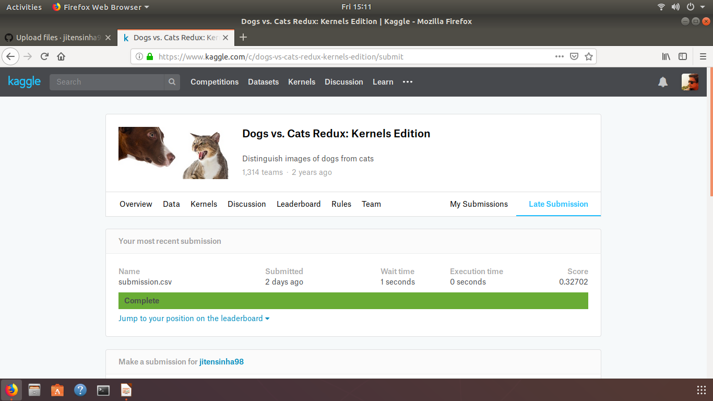
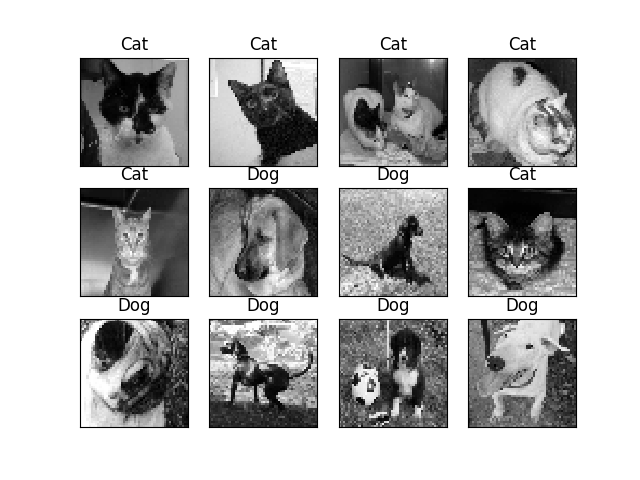

# Cats-vs-Dogs_image-Classifier
A Conv-net which is trained using Keras(uses Tensorflow in backend) to classify between Cats and Dogs.

## Description
This project is based on the kaggle challenge Dogs Vs Cats kernel edition.To know more [click here](https://www.kaggle.com/c/dogs-vs-cats-redux-kernels-edition)

## How to use
- The code is provided in ***CNN.py*** .To run code execute the following bash command in the folder's terminal:
  ```
  python3 CNN.py
  ```
- The model will be saved in ***Saved_Model*** directory.
- If you want to use an already trained model, avoid executing ***CNN.py*** and navigate to directory ***Saved_Model*** to use the pre-existing model having an accuracy of ***89%***.
- ***Test_label.csv*** contains the image name along with their predicted labels. It can be obtained by executing ***generate_labels.py***.
```
python3 generate_labels.py
```
## Modules Used
- Keras
- scikit-learn
- numpy
- pandas
- opencv
- matplotlib
- tqdm

## Result


## Images 
 

## Author
- Jiten Sinha -[LinkedIn](https://www.linkedin.com/in/jiten-sinha-131043159/)

## License
Read [LICENSE.md](https://github.com/jitensinha98/Cats-vs-Dogs_image-Classifier/blob/master/LICENSE) to know more.
